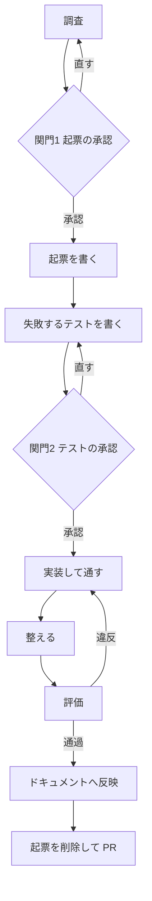

# 変更の進め方

このリポジトリでコードに手を入れるときの手順を定める。何を書くかの規約は `docs/` にある。このスキルが持つのは順序と関門だけである。段の構成はバックエンドの `change-flow` と揃えている。

書く内容の判断で迷ったら次を読む。ここには写さない。

| 知りたいこと                     | 置き場                                          |
| -------------------------------- | ----------------------------------------------- |
| 起票の雛形                       | `docs/changes/template.md`                      |
| コーディング規約・テストの書き方 | `docs/architecture/coding-standards.md`         |
| ドキュメントの更新先             | `docs/documentation-rules.md`                   |
| 機械で判定できる規約             | `docs/architecture/convention-checks.md`        |
| 用語                             | バックエンドの `docs/domain/shared/glossary.md` |
| API の振る舞い                   | バックエンドの `docs/specs/features/`           |

バックエンドの `docs/` は `../../backend/laravelapp/docs/` にある。

## このスキルを使わない場面

| 依頼                                   | 扱い                                                         |
| -------------------------------------- | ------------------------------------------------------------ |
| 調べてほしい、どうなっているか知りたい | 調べて答える。起票もテストも作らない                         |
| ドキュメントだけを直したい             | `documentation-conventions` に従って直す                     |
| 設定ファイルや依存の更新だけ           | 手順に乗せず直接行う                                         |
| 見た目だけの調整（余白・色・並び）     | 手順に乗せず直接行い、画面を開いて確かめる。テストは書かない |

見た目だけの調整かどうかは、振る舞いが変わるかで決める。表示する条件や文言が変わるなら振る舞いの変更であり、手順に乗せる。

着手してから対象外だと分かったときは、その場で依頼者に伝えて手順を降りる。起票を作ってしまっている場合は削除する。

## 全体



依頼者には開発の経験が浅い者が多い。各段の初めに、いまどこにいて次に何が起きるかを1文で伝える。黙って進めない。

## 各段で確定するもの

| 段      | 確定するもの                           | まだ確定しないもの             |
| ------- | -------------------------------------- | ------------------------------ |
| 2 起票  | やること・やらないこと・前提にする API | 受け入れ基準の文言。実装の詳細 |
| 4 関門2 | 画面で何を確かめるか（仕様の確定点）   | —                              |
| 5 実装  | 受け入れ基準の ID（新設する場合）      | 受け入れ基準の文言             |
| 8 反映  | 受け入れ基準の文言                     | —                              |

受け入れ基準の文言を段2で書かないのは、関門2で差し戻されると誤った記述が恒久文書に残るためである。

## 0 調査

実装に入る前に、関係する既存の仕様と実装を読む。

- バックエンドの `docs/domain/open-questions.md` を見る。依頼の主題が未確定として記録済みかもしれない。扱いはバックエンドの `change-flow` と同じである
  - 依頼が暫定方針と同じ方向 → そのまま進める
  - 依頼が暫定方針を覆す方向 → 関門1の提示に、その矛盾と未確定事項の ID を含める
  - 記録がなく判断できない → 勝手に決めず、関門1で確認する
- 触る画面の `docs/specs/screens/` を読み、変える受け入れ基準の ID を控える。画面仕様がまだなければ、その旨を控える（段8で書き起こす）
- 画面が使う API の振る舞いをバックエンドの `docs/specs/features/` で確かめる。必要な API がまだないなら控える
- 触る画面の実装を読む。近い画面の Container・フック・テストの書き方を見て、合わせる先を決める

分からないことが残ったまま関門1へ進まない。

## 1 関門1 起票の承認

起票のファイルを作る前に、AskUserQuestion で承認を取る。無断で書き始めない。

提示するものは3点だけにする。必要な API がまだないときは、その扱いも併せて聞く。

- 変更する振る舞い（利用者から見た画面の変化。対応する受け入れ基準の ID があれば添える）
- 変更する範囲（責務の単位で。ファイル名を並べない）
- 対象外（この変更でやらないこと）

書き方と選択肢は [references/gates.md](references/gates.md) にある。

承認が得られなかったら段0へ戻る。起票を書き進めない。

## 2 起票を書く

`docs/changes/<変更を表す名前>.md` に `docs/changes/template.md` の雛形で書く。採番しない。ファイル名は英語の小文字とハイフンでつなぐ。

テストの計画を書かない。テストケースの一覧、テストファイルの名前や配置は含めない。それらは段3で実物として示し、段4で承認を取る。

業務ルールが判明したときは、この段でバックエンドの `docs/domain/shared/business-rules.md` へ反映する。未確定事項は解消しない。

## 3 失敗するテストを書く

実装より先にテストを書く。この時点では落ちることを確認する。書き方の詳細は `docs/architecture/coding-standards.md` の「テスト」にある。

確かめるのは、操作の結果と状態による出し分けだけである。

| 書く                                           | 書かない                             |
| ---------------------------------------------- | ------------------------------------ |
| ログインに失敗したとき、失敗の理由が表示される | ログインの API に正しい値が送られる  |
| 期限切れの受講では、完了のボタンが出ない       | 検索ボックスの隣に検索のボタンがある |
| 送信中は、もう一度送信できない                 | 見出しが太字で表示される             |

- Container を描画し、データのフックは `vi.mock` で差し替えて状態を与える。通信を差し替えない
- 要素は役割・ラベル・文言で探す。クラス名で探さない
- `describe` と `it` は日本語で、利用者の言葉にする
- `Arrange`・`Act`・`Assert` をコメントで書く
- 対応する受け入れ基準があれば、`it` の直前に AC-ID をコメントで書く。新しく振るときは番号を決めて書き、`docs/specs/` への追加は段5で行う

まだ存在しない部品やフックを対象にするときは、Container とフックの空の骨組み（何も表示しない・何もしない）だけを先に作ってよい。テストが import の失敗で落ちると、振る舞いがないから落ちているのかを確かめられないためである。

書いたら実行し、意図した理由で落ちていることを確かめる。

```bash
scripts/run pnpm test <テストファイルのパス>
```

## 4 関門2 テストの承認

実装に入る前に、AskUserQuestion で承認を取る。ここが仕様の確定点である。

テストのコードを見せない。画面で確かめることを利用者の言葉で列挙する。提示する形は [references/gates.md](references/gates.md) にある。

承認が得られなかったら段3へ戻ってテストを直す。実装に入らない。

## 5 実装して通す

テストを通す実装を書く。通すために必要な範囲を超えて書かない。

- Container と Presentational に分ける。データの取得と送信は Container とフックに置く
- 読み込み中は Suspense、取得の失敗は ErrorBoundary に任せ、0件の表示を決める（`coding-standards.md` の「非同期の状態」）。Suspense が合わないと思ったら、分岐で書かずに依頼者へ伝える
- 起票の対象外に挙げたものに手を出さない。途中で必要だと分かったら、その場で広げずに依頼者へ伝える

新しい受け入れ基準を作る変更では、実装と一緒に ID と一文を `docs/specs/screens/` の該当ファイルへ追加する。段7の検査が ID の実在を見るため、ここで足しておかないと必ず落ちる。文言は暫定でよく、段8で仕上げる。

## 6 整える

規約に合わせて整理する。振る舞いは変えない。

```bash
scripts/run pnpm format
```

## 7 評価

次をすべて通す。1つでも落ちたら段5へ戻る。

```bash
scripts/run pnpm format:check        # 整形
scripts/run pnpm lint                # ESLint（import の向きを含む）
scripts/run pnpm check-conventions   # テストとドキュメントの規約
scripts/run pnpm type-check          # 型
scripts/run pnpm test                # 全テスト
```

これらは規約に合っているかと、テストに書いたことだけを見ている。最後に画面を実際に開き、変更した振る舞いを操作して確かめる。バックエンドが起動していなければ依頼者に伝え、確かめられなかったことを報告に書く。確かめずに完了としない。

全テストを通すのは、変えていない振る舞いを壊していないか確かめるためである。着手前から落ちていたものは、`git stash` で変更前に戻して同じ理由で落ちるかを確かめ、そうなら記録して先へ進んでよい。

## 8 ドキュメントへ反映

受け入れ基準の文言と、実装の構成の記述を仕上げる。更新先の対応表は `docs/documentation-rules.md` にある。

画面仕様がまだない画面を触ったときは、この段で `docs/specs/screens/<画面>.md` を書き起こす。今回変えた振る舞いと、テストで確かめた振る舞いだけを書く。画面の全部を推測で埋めない。

文書を増やさず、既存の記述を上書きする。ID は維持する。

## 9 起票を削除して PR

起票は一時文書である。実装が終わったらファイルごと削除する。削除したあと、取り込む前の検査を通す。

```bash
scripts/run pnpm check-conventions-merge
```

コミットは意味のある単位に分ける。何を変えたかではなく、なぜ変えたかを本文に書く。

ブランチと PR は次に従う。統合用のブランチは `main` ではなく `develop` である。

| 項目               | 決まり                                           |
| ------------------ | ------------------------------------------------ |
| 作業ブランチの起点 | 最新の `develop`（着手の前に取り込んでから切る） |
| PR の向き先        | `develop`。`main` へ向けない                     |
| 出す前             | 作業ブランチを push してから PR を作る           |

## 中断したとき

`docs/changes/` に起票が残っていれば、その変更は途中である。

| 状態                               | いまいる段 |
| ---------------------------------- | ---------- |
| 起票がない                         | 段0        |
| 起票はあるがテストがない           | 段3        |
| テストがあり落ちている             | 段4        |
| テストが通っている                 | 段7        |
| 起票が残ったまま実装が終わっている | 段8        |

判断がつかないときは依頼者に聞く。推測で進めない。

## やってはいけないこと

- 関門を飛ばす。承認なしで起票を書く、承認なしで実装に入る
- 関門でテストのコードを見せる
- 実装を書いてからテストを書く
- 通信や見た目を確かめるテストを書く
- 起票にテストの計画を書く
- 起票の対象外に挙げたものに手を出す
- 評価が落ちたまま次へ進む
- 画面を開いて確かめずに完了とする
- 起票を残したまま PR を出す
