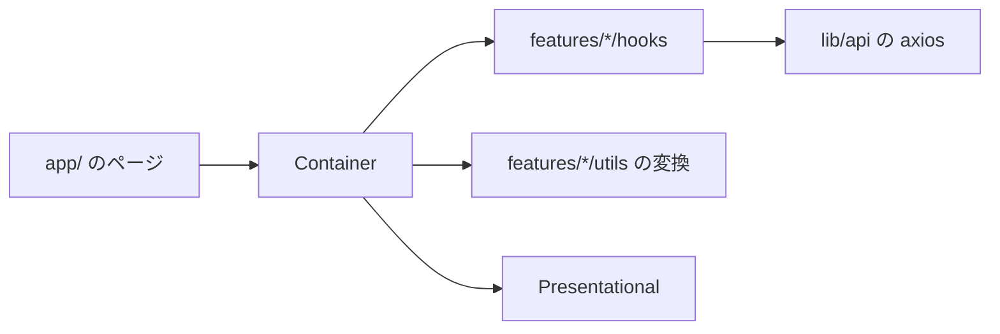

# 技術構成

## 技術スタック

| 区分               | 採用                                                   |
| ------------------ | ------------------------------------------------------ |
| フレームワーク     | Next.js 16（App Router・React Compiler 有効）          |
| 言語               | React 19・TypeScript 5                                 |
| スタイル           | Tailwind CSS 4・shadcn/ui（Radix UI）                  |
| データの取得と送信 | SWR・axios                                             |
| フォーム           | React Hook Form・zod                                   |
| 非同期とエラー     | Suspense・react-error-boundary                         |
| テスト             | Vitest・React Testing Library・jsdom（ADR-FE-0001）    |
| 検査               | ESLint 9・Prettier・`scripts/check-conventions.mjs`    |
| 実行環境           | Node 24・pnpm 9（リポジトリの根の `mise.toml` で固定） |

バックエンドは Docker で動く Laravel の API である。フロントエンドはホストで動かし、`NEXT_PUBLIC_API_URL` の API を Sanctum の Cookie 認証で呼ぶ。

## ディレクトリの構成

```
src/
  app/                  ルーティング。ロール別の route group に分ける
    (guest)/            未ログイン向け
    (student)/          受講生向け
    (instructor)/       講師向け
  components/
    ui/                 shadcn/ui の生成物。直接参照しない
    atoms/              ui/ を再公開する層
    organisms/          ヘッダーなど、横断的な複合部品
    providers/          SWR などの Provider
    StatusMessage/      読み込み中・取得の失敗の表示
  features/<ドメイン>/
    components/<部品>/  Container と Presentational とテスト
    hooks/              データの取得と送信
    types/              API の応答の型
    utils/              応答を画面の形へ変換する関数・SWR のキー
    validation/         zod のスキーマ
  hooks/                横断的なフック
  lib/                  axios のインスタンス・画面のパス
  utils/                横断的な関数
  types/                横断的な型
  test/                 テストの共通設定
```

## データの流れ



ページは Container を並べるだけにする。Container がフックでデータを受け取り、変換して Presentational へ渡す。Presentational は受け取った値を表示し、操作をコールバックで返す。

## テストの構成

| 項目         | 内容                                                          |
| ------------ | ------------------------------------------------------------- |
| 設定         | `vitest.config.mts`（jsdom・`@/` の別名）                     |
| 共通の前処理 | `src/test/setup.ts`（jest-dom の照合・描画の後始末）          |
| 置き場       | テスト対象の Container と同じディレクトリに `<部品>.test.tsx` |
| 実行         | `scripts/run pnpm test`                                       |

書き方は `coding-standards.md` の「テスト」にある。
