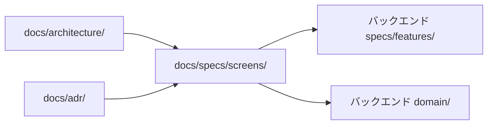

# ドキュメント運用ルール

このプロジェクトでの `docs/` の運用を定める。土台となる考え方は `.claude/skills/documentation-conventions/SKILL.md` にあり、バックエンドと同じものを使う。ここではフロントエンド固有の決めごとだけを書く。

前提として、業務知識とシステム仕様を混ぜない。フロントエンドはこれに加えて、画面の仕様と API の仕様を混ぜない。

## ディレクトリの役割

| 置き場               | 内容                                                 | 文の主語 | 改修時               |
| -------------------- | ---------------------------------------------------- | -------- | -------------------- |
| `docs/specs/`        | 画面の振る舞い・状態・遷移                           | システム | 上書き               |
| `docs/architecture/` | 技術スタック・実装の構成・コーディング規約           | システム | 上書き               |
| `docs/adr/`          | フロントエンドの意思決定の記録                       | —        | 追記のみ・過去は不変 |
| `docs/changes/`      | 変更単位の作業指示。着手時に起票し、実装後に削除する | —        | 一時                 |

業務知識（`docs/domain/`）はこのリポジトリに置かない。バックエンドの `docs/domain/` を唯一の正とする。フロントエンドの作業中に業務ルールが判明したときも、バックエンドの `docs/domain/` へ書く。

エージェント向けの指示は `AGENTS.md` に置く。索引と、取り違えると壊れる注意点だけを書き、仕様や規約の詳細は `docs/` 側に置く。Claude Code は `CLAUDE.md` から `AGENTS.md` を読み込む。ツールごとに指示を分けない。

## どこに書くかを決める

```
0. その主題は既にどこかに書かれているか（両リポジトリで grep -rn して確かめる）
     ├─ はい → その記述を上書きし、ID は維持する。ここで終了
     └─ いいえ ↓
1. 主語は「システム」か
     ├─ いいえ → 業務知識。バックエンドの docs/domain/ に書く
     └─ はい ↓
2. 画面がなくても成り立つ振る舞いか（API を直接呼んでも同じ結果になるか）
     ├─ はい → API の仕様。バックエンドの docs/specs/features/ に書く
     └─ いいえ ↓
3. 複数の画面に共通する振る舞いか
     ├─ はい → docs/specs/screens/conventions.md
     └─ いいえ → docs/specs/screens/<画面>.md
```

2 の判定が最も取り違えやすい。「期限切れの受講は受講状況を記録できない」は API の仕様であり、画面はその結果を表示するだけである。画面仕様には「期限切れの受講では記録の操作を出さない」のように、画面が何を表示し、どう操作させるかだけを書き、根拠を `AC-ENROLL-NNN` で参照する。

画面仕様に書かないものは次のとおりである。

| 書かないもの                     | 担当               |
| -------------------------------- | ------------------ |
| レイアウト・余白・色・部品の並び | デザイン（Figma）  |
| 型・桁数・単なる入力必須         | zod のスキーマ     |
| 応答に含まれる項目の一覧         | バックエンドの API |

## ID 体系

| 対象                       | 形式                     | 置き場                              |
| -------------------------- | ------------------------ | ----------------------------------- |
| 画面の受け入れ基準         | `AC-<画面の略称>-<連番>` | `docs/specs/screens/`               |
| 画面に共通する受け入れ基準 | `AC-SCREEN-<連番>`       | `docs/specs/screens/conventions.md` |
| 意思決定記録               | `ADR-FE-<連番>`          | `docs/adr/`                         |

画面の略称はバックエンドの機能の略称（`COMMON`・`AUTHZ`・`ACCOUNT`・`AUTHOR`・`ENROLL`・`PROG`・`ANALYTICS`・`NOTIF`・`TAG`）と重ねない。重ねると、ID を見てどちらのリポジトリを引けばよいか決められなくなる。画面の略称の一覧は `docs/specs/README.md` にある。

番号は振り直さない。削除したときは欠番のまま空け、なぜ欠番になったかをコメントで残す。追加は末尾に足す。

## 参照の向き



画面仕様からバックエンドの仕様を参照する。逆は持たせない。バックエンドの文書が画面の都合で書き換わらないようにするためである。

画面仕様から業務ルール（`BR-SHARED-NNN`）を直接参照するのは、その画面だけの扱いのときに限る。API の仕様に実体があるなら `AC-<機能>-NNN` を参照する。

## 用語と文体

用語と文体はバックエンドの `docs/documentation-rules.md` に従う。用語はバックエンドの `docs/domain/shared/glossary.md` を唯一の正とする。画面に表示する文言も同じ用語を使う。

| 使う         | 使わない           |
| ------------ | ------------------ |
| 講座         | コース             |
| チャプター   | 章・セクション     |
| レッスン     | 単元               |
| 受講状況     | 学習進捗・出席状況 |
| 受講生       | 生徒・ユーザー     |
| マネージャー | 管理者             |

文体は次に従う。

- である調で書く
- 太字記法を使わない。強調は見出しと表で表す
- 区切り線を使わない。見出しの階層で区切る
- 図は mermaid で描く。画面遷移と状態の遷移は必ず mermaid で表す

## 実装が終わったとき

まず、その主題がすでにどこに書かれているかを検索で確かめる。既存の記述があれば ID を維持して上書きし、新しい主題のときだけ末尾に足す。

そのうえで、同じ変更のなかで次を更新する。

| 変更内容                       | 更新するファイル                                                            |
| ------------------------------ | --------------------------------------------------------------------------- |
| 画面の振る舞いを変えた         | `docs/specs/screens/<画面>.md`（上書き）                                    |
| 全画面に共通する扱いを変えた   | `docs/specs/screens/conventions.md`（上書き）                               |
| 実装の構成を変えた             | `docs/architecture/overview.md`（上書き）                                   |
| コーディング規約を変えた       | `docs/architecture/coding-standards.md`（上書き）                           |
| 技術選定の判断をした           | `docs/adr/` に新しい記録を追加（既存は上書きしない）                        |
| 業務ルールが判明・変更された   | バックエンドの `docs/domain/shared/business-rules.md`                       |
| API に求める振る舞いが変わった | バックエンドで起票する。フロントエンドの変更の中で API の仕様を書き換えない |

起票（`docs/changes/`）は上の表に含めない。恒久的に残す内容は反映してから起票ファイルごと削除する。

版を分けたファイル（`*_v2.md`・`*_old.md`・`*_20260928.md`）を作らない。状態を表す文書は上書きし、履歴は Git に任せる。

## 起票の置き場と書かないもの

これから作る変更の起票は `docs/changes/` に置く。規模によらずここに一本化し、ほかの置き場を作らない。雛形は `docs/changes/template.md` を使い、採番せず内容が分かるファイル名にする。

起票にはテストの計画を書かない。テストケースの一覧、テストファイルの名前や配置は含めない。
