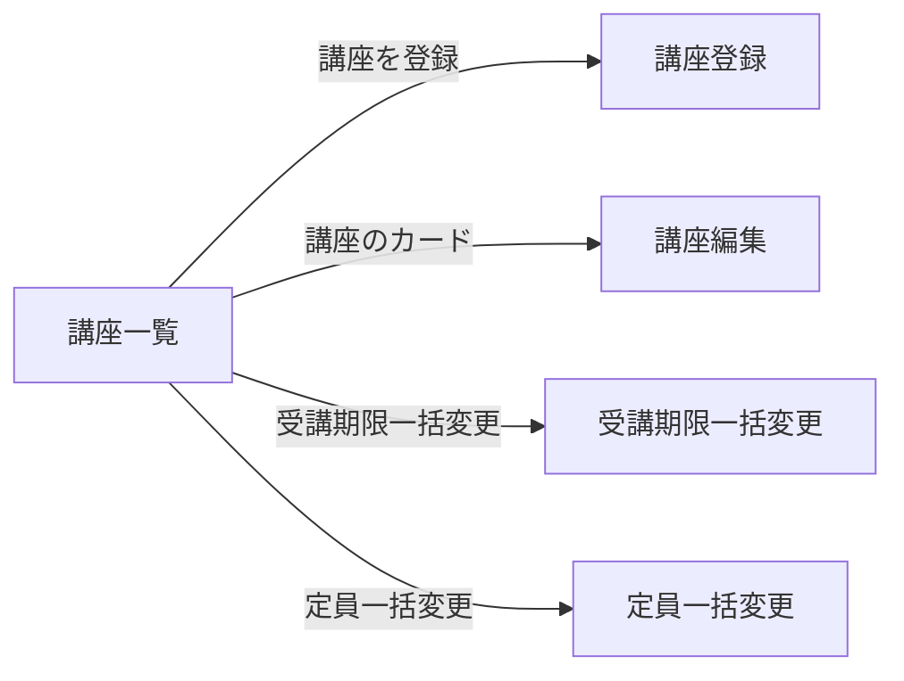

# 講師側 講座一覧

## 目的と利用者

講師が担当する講座を一覧し、選んだ講座の公開状態・受講期限・定員をまとめて変更する、または削除するための画面である。

## 関連コンテキスト

`shared`（ここでの「タグ」は講師が自分で作る講座の分類ラベルであり、画面では「分類」と表示する）

## パス

`/instructor/courses`

## 表示項目

講座は1件を1枚のカードで表示する。

| 項目     | 表示                                                                                     |
| -------- | ---------------------------------------------------------------------------------------- |
| 講座名   | そのまま表示する                                                                         |
| 受講期限 | 特定の日のときは「2025/12/31まで」、日数のときは「開始日から30日後」。期限なしは出さない |
| 受講中   | 受講中の受講生がいる講座に「受講中」の印を出す                                           |
| 定員     | 「定員：受講中の人数／定員」。定員のない講座には出さない                                 |
| 分類     | 講座に付いているタグの名前を並べる                                                       |

## 受け入れ基準

1. `AC-ICLIST-001` 講座が1件も選択されていないとき、システムは一括変更のメニューをすべて選べない状態にしなければならない。
2. `AC-ICLIST-002` 公開・非公開・受講期限をなくす・削除・定員をなくすのいずれかが選ばれたとき、システムは実行の前に確認ダイアログを出し、操作の内容と対象の件数を示さなければならない。
3. `AC-ICLIST-003` システムは、確認ダイアログで実行が選ばれたときだけ操作を実行しなければならない。キャンセルされたときは実行しない。
4. `AC-ICLIST-004` 受講期限一括変更または定員一括変更が選ばれたとき、システムは確認を挟まず、対象の講座を引き継いでそれぞれの画面へ遷移しなければならない。
5. `AC-ICLIST-005` 一括変更の対象は、選択された講座のうち画面に表示されているものに限らなければならない。検索で表示されなくなった講座は対象に含めず、選択は保持する。
6. `AC-ICLIST-006` 講座名で検索されたとき、システムは講座名に検索語を含む講座だけを表示しなければならない。英字の大文字と小文字は区別しない。合う講座がないときは、その旨を表示する。
7. `AC-ICLIST-007` 分類表示が有効のとき、システムは講座をタグごとの見出しにまとめて表示しなければならない。複数のタグが付いた講座はそれぞれの見出しに表示し、タグのない講座は「未分類」にまとめる。
8. `AC-ICLIST-008` 講座のカードが押されたとき、システムはその講座の編集画面へ遷移しなければならない。選択の操作では遷移しない。
9. `AC-ICLIST-009` 受講中の人数が定員以上の講座は、システムは定員を強調して表示しなければならない。

## 状態別の挙動

| 状態       | 表示                                 |
| ---------- | ------------------------------------ |
| 0件        | 「該当する講座はありません。」を出す |
| 読み込み中 | API に接続していないため生じない     |
| エラー     | API に接続していないため生じない     |

## 画面遷移

遷移先の画面はまだない。

## 対象外

- API との接続。講座は固定のデータを表示し、一括変更は実行の記録だけを行う
- ページの切り替え。ページネーションは表示だけである
- サムネイル画像の表示。仮の表示を出す
- マネージャーが見たときの講師名とプロフィール画像の表示
