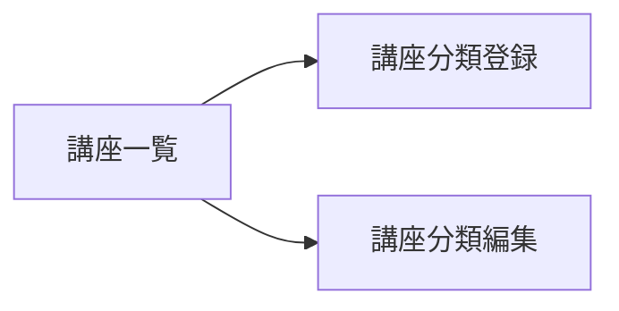

# 講師側 講座分類登録・講座分類編集

## 目的と利用者

講師が講座の分類を登録する、または登録済みの分類の名前を変える・分類を削除するための画面である。登録と編集は同じフォームを使う。

## 関連コンテキスト

`shared`（ここでの「タグ」は講師が自分で作る講座の分類ラベルであり、画面では「講座分類」と表示する）

## パス

| 画面         | パス                             |
| ------------ | -------------------------------- |
| 講座分類登録 | `/instructor/tags/new`           |
| 講座分類編集 | `/instructor/tags/<タグID>/edit` |

## 表示項目

| 項目         | 講座分類登録 | 講座分類編集               |
| ------------ | ------------ | -------------------------- |
| 分類タイトル | 空で表示する | 今の分類タイトルを表示する |
| 送信のボタン | 「登録」     | 「更新」                   |
| 削除のボタン | 出さない     | 出す                       |

## 受け入れ基準

1. `AC-ITAG-001` 分類タイトルが入力の検証を通らないとき、システムは登録も更新もせず、理由を入力欄の下に表示しなければならない。未入力と文字数の上限（AC-TAG-002）の超過を検証する。
2. `AC-ITAG-002` 検証を通った分類タイトルで登録または更新が押されたとき、システムは入力された分類タイトルで登録または更新を実行しなければならない。
3. `AC-ITAG-003` 講座分類編集が開かれたとき、システムは今の分類タイトルを入力欄に入れて表示しなければならない。
4. `AC-ITAG-004` 削除が押されたとき、システムは実行の前に確認ダイアログを出し、削除する分類のタイトルと、削除すると元に戻せないことを示さなければならない。
5. `AC-ITAG-005` システムは、確認ダイアログで「削除する」が選ばれたときだけ削除を実行しなければならない。キャンセルされたときは実行しない。

## 状態別の挙動

| 状態       | 表示                                                                                                     |
| ---------- | -------------------------------------------------------------------------------------------------------- |
| 送信中     | 登録・更新・削除のボタンを押せなくし、送信のボタンに送信中の旨を出す                                     |
| 読み込み中 | 講座分類編集で分類タイトルを取得している間、「読み込み中...」を出す。講座分類登録では生じない            |
| エラー     | 講座分類編集で分類タイトルの取得に失敗したとき、「エラーが発生しました」を出す。講座分類登録では生じない |

## 画面遷移

講座一覧からの導線はまだない。登録・更新・削除のあとの遷移先は JKA-1866 で決める。

## 対象外

- 登録・更新・削除の API への送信、失敗したときの表示、成功したあとの遷移（JKA-1866）。今は実行の記録だけを行う
- 講座に付いている分類を削除できない扱い（AC-TAG-005）の表示
